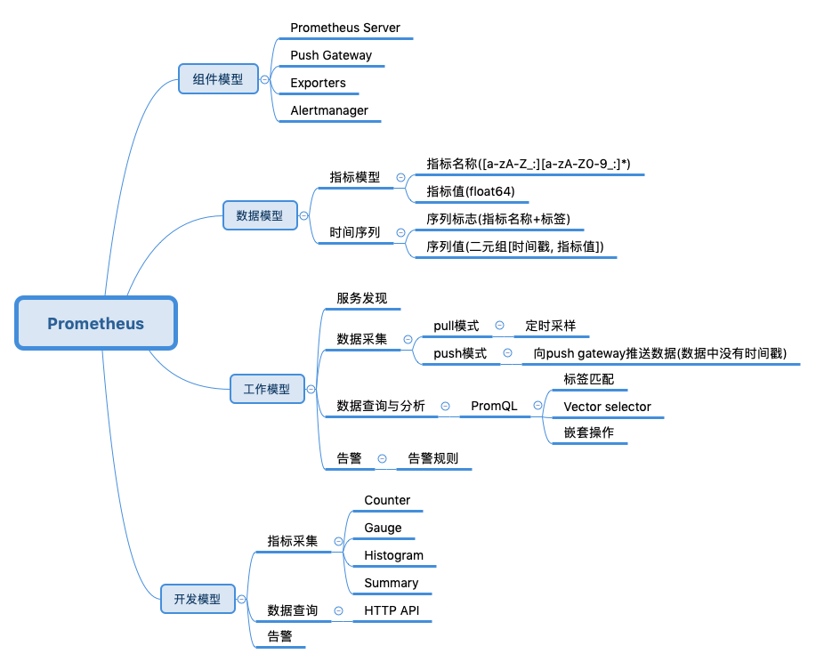

# 基础信息
> 部分内容摘录自他人博客

## Prometheus概览


Prometheus由server, exporter, push gateway和alert manager组成。

- server: 用于存储时间序列数据和整个服务的管理
- exporter: 用于生成指标数据
- push gateway(非必须): 则是用于接收所有的metric
- alert manager(非必须): 用于设置告警规则

## Prometheus指标
在Prometheus中提供了四种指标模型，分别为：Counter,Gauge,Histogram,Summary。

- Counter：一种累加的指标，用于表示持续的计数。典型的应用如：请求的个数，code=200的个数, 报错次数
- Gauge: 一种标识即时测量值指标, 例如内存、CPU、请求耗时的即时状态
- Histogram: 直方图结果(通常是请求持续时间或响应大小之类的东西)进行采样，并在可配置的桶中计数。还提供了所有观测值的和.
- Summary: 计算了一个滑动时间窗口上的可配置分位数

查询语言采用PromQL, 查询语言由关键字, 条件键值对,运算符等组成, 例如:

http_requests_total{code!="200"}  // 表示查询 code 不为 "200" 的数据
http_requests_total{code=～"2.."} // 表示查询 code 为 "2xx" 的数据
http_requests_total{code!～"2.."} // 表示查询 code 不为 "2xx" 的数据

## grafana简介
Grafana是一个开源的度量分析与可视化套件, 目前支持多种数据源, 每个数据源都有对应的查询编辑器, 不同数据源的数据可以展示到同一个仪表盘. 目前目前支持的数据源Graphite，InfluxDB，OpenTSDB，Prometheus，Elasticsearch，CloudWatch等.下面介绍下grafana中涉及到的一些典型概念

- DataSource: 数据源, 及各类时间序列数据来源
- Panel: grafana中的基础呈现块, 每个pannel都支持一个query editor以辅助展示所提取的值. 每个pannel都支持拖拽调整大小
- Row: 在一个DashBoard中, 用来组织panel的模块
- DashBoard: 所有的panel和Row汇总到一个DashBoard组成一个项目所需要展示的图表

## grafana配置
### smtp
```ini
[smtp]
enabled = true
host = smtp.qq.com:465
# qq邮箱
user = xxx@qq.com 
# If the password contains # or ; you have to wrap it with trippel quotes. Ex """#password;"""
# 使用qq邮箱smtp的授权码
password = pkxxxxxx
from_address = xxx@qq.com
```


## 疑问
- 优势是什么？
    - 轻量?
    - 快速部署
    - 云原生?
    
- 高可用方案?
    - Server单点问题
    - 本地TSDB故障异常
    
- target动态发现问题?
    - file_sd 可能存在缺陷